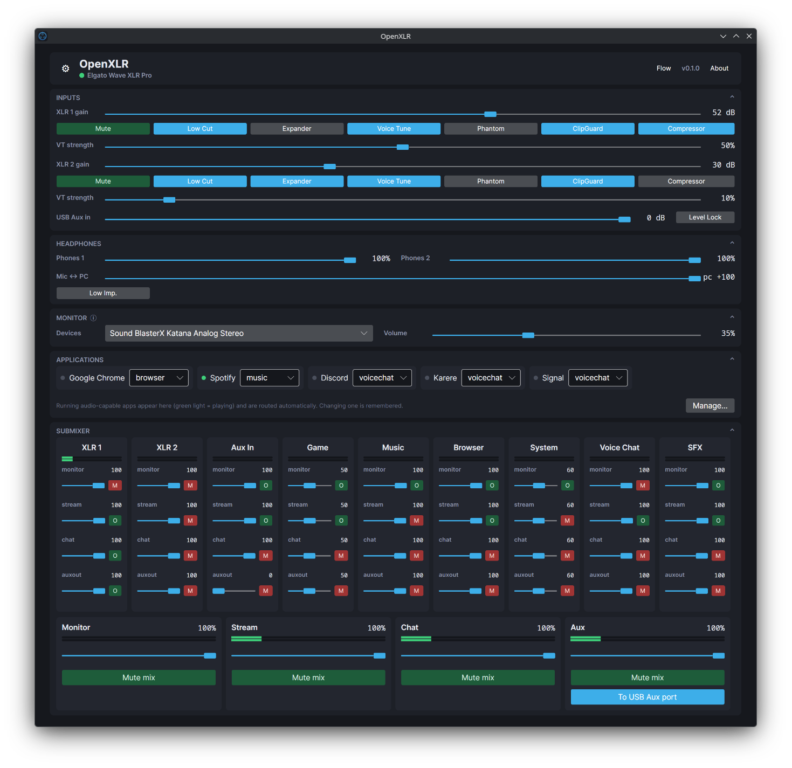
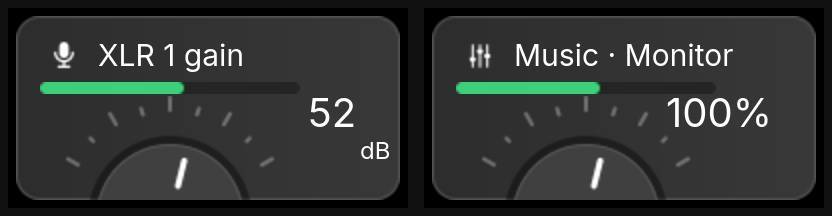
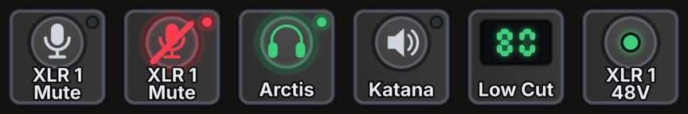

# OpenXLR

Native Linux control suite for Elgato XLR interfaces: full hardware
control over reverse-engineered USB protocols, a Wave Link style
PipeWire submixer with per-application channels, virtual microphones,
multi-output monitoring, a dedicated mix for a second computer on the
USB Aux port, and an OpenDeck plugin for Stream Deck control.



Elgato ships no Linux software. These devices enumerate as
class-compliant USB audio interfaces, so audio flows out of the box.
Gain, DSP, phantom power, output routing and the hardware mixer only
answer to vendor protocols, which this project reverse engineered from
USB captures of Wave Link and reimplemented from scratch. The Pro
protocol is documented in
[docs/wave-xlr-pro-protocol.md](docs/wave-xlr-pro-protocol.md).

Not affiliated with or endorsed by Elgato. Built by protocol analysis on
the author's own hardware.

## Supported devices

| Device | USB id | Status |
|---|---|---|
| Wave XLR Pro | 0fd9:00b4 | full support, verified on hardware |
| XLR Dock (Stream Deck+ module) | 0fd9:00a6 | gain, mute, headphone volume, 48V phantom power, low impedance; verified on hardware |
| Wave XLR | 0fd9:007d | gain, mute, headphone volume, low impedance, 48V phantom power; verified on hardware by a community tester |
| Wave XLR MK.2 | 0fd9:00b6 | gain, mute, DSP, headphone volume, crossfade; decoded from captures, needs a tester |
| XLR Dock MK.2 (Stream Deck+ module) | id unknown | same Wave FX platform as the MK.2, so support is likely one small step away; owners, open an issue with your `lsusb` output |

The UI shows only the controls the connected device has. With more than
one supported interface attached, a picker in the header chooses which
one OpenXLR drives; the mixer's input channels move with it. The full
per-control state of every device lives in
[docs/hardware-support.md](docs/hardware-support.md). Own one of the
untested devices? Open an issue with a diagnostics archive (Options,
SUPPORT, Collect diagnostics) and help confirm the last two rows.

The submixer itself is pure PipeWire and already works with any audio
interface; only the hardware-control layer is per-device. Backends are
registered by USB id behind one device interface, so support for
interfaces from other brands may be added in the future.

## Features

### Hardware control

Everything Wave Link exposes for the device. The full set, on the Wave
XLR Pro:
- Per-XLR input: gain (0 to 80 dB), mute, low cut, expander, voice tune with
  strength, phantom power, ClipGuard, compressor
- USB Aux input stage: level (0 to −60 dB) and level lock
- Both headphone outputs: independent volumes, low-impedance mode
- Mic ↔ PC zero-latency direct-monitor crossfade
- Physical output routing: each output (Headphones 1/2, Line Out, USB Aux)
  is switched in the device's own hardware mixer

On the others, what their protocols expose so far:
- Wave XLR MK.2: gain, mute, low cut, expander, voice tune with strength,
  headphone volume, low impedance, crossfade
- Wave XLR: gain, mute, headphone volume, low impedance, phantom power
- XLR Dock: gain, mute, headphone volume, driven through the kernel's
  standard ALSA controls, plus 48V phantom power and headphone low
  impedance over the original Wave XLR's protocol dialect, which the
  dock turns out to speak. The
  [openwave](https://github.com/rikkichy/openwave) project identified
  the phantom byte on the MK.1 against its 48V LED
  ([openwave PR #8](https://github.com/rikkichy/openwave/pull/8)); we
  confirmed the same register live on the dock with a condenser
  microphone. Wave Link itself never writes it for the dock, so this is
  a control the hardware has that the official software does not offer.
  The dock has no onboard DSP; Wave Link runs those effects host-side,
  so their Linux home is the submixer

### Software controls

For devices whose DSP lives host-side, OpenXLR provides the equivalents
in its PipeWire layer. They appear only when the active device lacks the
hardware version, so nothing is ever filtered twice:
- Low cut: a high-pass at 80 or 120 Hz (Wave Link's choices) inserted
  between the mic and its channel, cycled from a button on the XLR 1
  strip. Measured at the textbook second-order response and self-healing
  if its filter node ever dies
- ClipGuard: a hard limiter at -3 dB in the same filter chain, so a
  sudden shout cannot clip the recording (needs the swh-plugins LADSPA
  package)
- Gain lock: the daemon rejects every gain change while the lock is set,
  from any client, and remembers it per device across restarts. Shown
  only for devices without physical controls; a lock the hardware's own
  dial could bypass would be a lie

Two safety behaviors come with multi-device switching: the mixer's
input channels follow the active device, and a device switch brings the
hardware channels' monitor sends up muted, so a hot mic can never howl
through the speakers the moment it is patched in.

### Submixer

Pure PipeWire, no custom drivers or kernel modules:
- Channels for the hardware inputs (XLR 1, XLR 2, Aux In) and for
  application groups (Game, Music, Browser, System, Voice Chat, SFX)
- Four mixes: Monitor (what you hear), Stream and Chat (published as
  virtual microphones selectable in OBS/Discord), and Aux (what a second
  computer on the USB Aux port receives)
- Per-channel, per-mix send levels and mutes; per-mix masters
- Monitor mix playable on several outputs at once, hardware outputs
  included
- Live level meters throughout, dB-scaled

### Application routing
- OpenXLR detects every running audio-capable app through its PipeWire
  client registration and routes it to a channel by rules; it remembers
  each assignment, editable even while the app is silent
- Truthful names for Electron apps (Discord is "Discord", not "Chromium")
- Manage dialog with the full app registry and an installed-application
  picker to pre-assign channels from `.desktop` entries

### Profiles

Named scenes: every hardware setting plus the whole submix (send levels,
mutes, masters, monitor outputs, aux state). Saved per device, recalled
from the header or over the API, so a Stream Deck key can switch scenes.
App routing and system defaults stay global on purpose: recalling a
scene never rewires the desktop.

### OpenDeck plugin

`plugin/com.emaspa.openxlr.sdPlugin` puts the whole rig on a Stream Deck
via [OpenDeck](https://github.com/nekename/OpenDeck), drawn like the
hardware it controls.

Dials get Wave Link style touch panels: a knob with a moving needle, a
live level meter, the value readout, and a mute overlay. Every send,
mix master, gain, headphone volume, and the crossfade is a dial target,
and one dial can hold a stack of targets cycled by tap or press. The
panels are also touch draggable: swipe across one and the value moves
by the drag distance when you lift your finger.



Keys are drawn as buttons on the same faceplate: the icon on a machined
cap, a status LED, red for a mute, green for an engaged feature or the
active monitor output. Every hardware switch and mute is a key target,
plus the software low cut (its frequency shown as LED digits, cycling
Off, 80, 120), ClipGuard, gain lock, and monitor-output switching to a
specific device. Each key can pick its icon (a headphone output shows
headphones, not a speaker), and a typed title replaces the built-in
label.



Everything reads and writes daemon state, so keys and dials stay in
sync with the UI and the hardware at all times.

To install: download `com.emaspa.openxlr.sdPlugin.zip` from the
[latest release](https://github.com/emaspa/openxlr/releases/latest) and
use OpenDeck's install-from-file, or copy the plugin folder into
`~/.config/opendeck/plugins/` (a symlink breaks OpenDeck's asset
serving; the AUR package ships the folder in `/usr/share/openxlr/`).
Touch taps on the Stream Deck + XL need OpenDeck newer than 2.14.0
([nekename/OpenDeck#437](https://github.com/nekename/OpenDeck/pull/437),
merged upstream). Touch dragging the dial panels needs an OpenDeck
build that turns touch strip swipes into dial ticks
([nekename/OpenDeck#441](https://github.com/nekename/OpenDeck/pull/441),
draft); stock OpenDeck up to 2.14.0 discards swipe gestures, so until
that lands the dials still adjust normally by rotation.

### Quality of life
- Live Audio Flow graph of the whole routing, sources through outputs
- The daemon holds your chosen system-default devices and re-asserts them
  every second, the way Wave Link does
- Tray icon, start-minimized option, autostart integration
- One-click diagnostics archive for bug reports

## Architecture

```
                     WebSocket (127.0.0.1:37890, JSON)
   OpenXLR.UI   ────────────────┐
   (Avalonia)                   ▼
                         OpenXLR.Daemon  ── libusb ──►  Elgato interface
   OpenDeck plugin ────► (ASP.NET Core)                 (vendor protocol)
   scripts, tools               │
                                └── pactl / pw-cli / pw-link ──► PipeWire graph
```

- `OpenXLR.Daemon` owns everything: it connects the device, polls its
  state, builds and maintains the PipeWire graph, routes application
  streams, and serves a WebSocket API. It broadcasts every state change
  to all clients, whichever client (or the hardware) caused it.
- `OpenXLR.UI` is a stateless view over that API and can be closed at any
  time; the daemon keeps mixing.
- `OpenXLR.Core` holds the device backend and the mixer engine; the
  daemon and any future tooling share it.

### The PipeWire graph

Applications play into per-channel combine sinks whose internal streams
(one per mix) are the faders. The whole 9x4 matrix costs 13 sinks and zero
loopback processes, and direct port links clock everything through the
output device. Hardware inputs are wired by capture-channel pair
(XLR 1 = pair 0, XLR 2 = pair 1, Line In/USB Aux = pair 2). Stream and Chat
mixes are published as `OpenXLR Stream` / `OpenXLR Chat` capture devices;
the Aux mix feeds the device's aux return pair so the hardware forwards it
to the USB Aux port.

### The device protocols

The four devices speak three different dialects:

- Wave XLR Pro and MK.2: a vendor block bank on the unclaimed interface
  (`bmRequestType 0x41/0xC1`, `bRequest 1`, `wIndex 0x0103` on the Pro,
  `0x0203` on the MK.2). Fixed-size blocks hold gain, packed flag bits,
  and the hardware mix matrix; a write reads the block, modifies it,
  writes it back, and follows with a commit block. Full offsets and the
  discovery story: [docs/wave-xlr-pro-protocol.md](docs/wave-xlr-pro-protocol.md)
- Wave XLR (MK.1) and XLR Dock: a small class-request protocol
  (`bRequest 0x85/0x05`, `wIndex 0x3303`) with one config block, proven
  by the openwave project. The dock turned out to speak it too, which is
  how it gained phantom power (config byte 6) and low impedance (byte
  33); its everyday controls (gain, mute, headphone volume) ride the
  kernel's standard ALSA path, and its DSP is provided host-side by the
  submixer

## Requirements

- Linux with PipeWire 1.4 or newer (developed on 1.6), `pipewire-pulse`
  and WirePlumber; `pactl`, `pw-cli`, `pw-link`, `pw-dump`, `parec` on PATH
- `swh-plugins` (LADSPA) for the software ClipGuard; everything else
  works without it
- .NET 10 SDK to build (runtime to run)
- libusb 1.0
- A supported Elgato interface (see the table above); the submixer works
  with any of them, and the aux and output routing features follow the
  device's capabilities

## Install

### Arch Linux (AUR)

```sh
yay -S openxlr        # or: paru -S openxlr
systemctl --user enable --now openxlr-daemon
openxlr               # the mixer UI, also in your application menu
```

The package ships the udev rules and the XLR Dock's WirePlumber rule;
replug your interface once after installing so the rules apply. The
OpenDeck plugin lands in `/usr/share/openxlr/`, copy it into
`~/.config/opendeck/plugins/` to use it.

### Ubuntu (.deb)

Ubuntu 24.04 or newer. Download `openxlr_<version>_amd64.deb` from the
[latest release](https://github.com/emaspa/openxlr/releases/latest),
then:

```sh
sudo apt install ./openxlr_*_amd64.deb
systemctl --user enable --now openxlr-daemon
openxlr               # the mixer UI, also in your application menu
```

apt pulls in the .NET runtime and PipeWire dependencies from the
archive. As with the AUR package, the udev rules and the XLR Dock's
WirePlumber rule are included; replug your interface once after
installing. The OpenDeck plugin lands in `/usr/share/openxlr/`, copy it
into `~/.config/opendeck/plugins/` to use it. For the software
ClipGuard on the XLR Dock, also `sudo apt install swh-plugins`.

### Fedora (.rpm)

Fedora 44 or newer. Download `openxlr-<version>.x86_64.rpm` from the
[latest release](https://github.com/emaspa/openxlr/releases/latest),
then:

```sh
sudo dnf install ./openxlr-*.x86_64.rpm
systemctl --user enable --now openxlr-daemon
openxlr               # the mixer UI, also in your application menu
```

dnf pulls in the .NET runtime and PipeWire dependencies from the
Fedora repos. The udev rules and the XLR Dock's WirePlumber rule are
included; replug your interface once after installing. The OpenDeck
plugin lands in `/usr/share/openxlr/`, copy it into
`~/.config/opendeck/plugins/` to use it. For the software ClipGuard on
the XLR Dock, also `sudo dnf install ladspa-swh-plugins`.

### NixOS (flake)

The repo is a flake with a package and a NixOS module that wires up the
daemon, the udev rules, and the WirePlumber rule. In your system flake:

```nix
{
  inputs.openxlr.url = "github:emaspa/openxlr";

  # in your NixOS configuration:
  imports = [ openxlr.nixosModules.default ];
  services.openxlr.enable = true;
}
```

Rebuild, replug the interface once so the udev rules apply, and the
`openxlr` mixer UI is in your application menu. The module starts the
daemon as a user service and points it at the SWH LADSPA plugins so
ClipGuard works on the XLR Dock (`services.openxlr.clipGuard = false;`
turns that off). The OpenDeck plugin ships in the package's
`share/openxlr/`, copy it into `~/.config/opendeck/plugins/`.

### From source

A complete deploy from source, top to bottom. Every step is explicit;
nothing assumes an earlier OpenXLR on the machine.

### 1. Prerequisites

The .NET 10 SDK, PipeWire with its CLI tools, and libusb. Package names
by distribution:

```sh
# Arch
sudo pacman -S --needed dotnet-sdk pipewire pipewire-pulse wireplumber libusb
# optional, enables the software ClipGuard for the XLR Dock:
sudo pacman -S --needed swh-plugins

# Fedora
sudo dnf install dotnet-sdk-10.0 pipewire pipewire-pulseaudio wireplumber libusb1 ladspa-swh-plugins

# Debian / Ubuntu (dotnet from Microsoft's feed if the distro lacks 10.0)
sudo apt install dotnet-sdk-10.0 pipewire pipewire-pulse wireplumber libusb-1.0-0 swh-plugins
```

Verify the audio stack is PipeWire before going further:

```sh
pactl info | grep "Server Name"    # should say PulseAudio (on PipeWire ...)
```

### 2. Build

```sh
git clone https://github.com/emaspa/openxlr.git
cd openxlr/src
dotnet build -c Release
```

Binaries land in `src/OpenXLR.Daemon/bin/Release/net10.0/` and
`src/OpenXLR.UI/bin/Release/net10.0/`.

### 3. Device access (udev rule, then replug the device):

```sh
sudo tee /etc/udev/rules.d/70-openxlr.rules << 'EOF'
SUBSYSTEM=="usb", ATTRS{idVendor}=="0fd9", ATTRS{idProduct}=="00b4", MODE="0660", TAG+="uaccess"
SUBSYSTEM=="usb", ATTRS{idVendor}=="0fd9", ATTRS{idProduct}=="00a6", MODE="0660", TAG+="uaccess"
SUBSYSTEM=="usb", ATTRS{idVendor}=="0fd9", ATTRS{idProduct}=="007d", MODE="0660", TAG+="uaccess"
SUBSYSTEM=="usb", ATTRS{idVendor}=="0fd9", ATTRS{idProduct}=="00b6", MODE="0660", TAG+="uaccess"
EOF
sudo udevadm control --reload
```

### 4. XLR Dock only: the capture-hold rule

XLR Dock owners need one more file. The Linux kernel starves the dock's
capture endpoint whenever playback to it starts before capture, and the
mic then records pure silence (Windows schedules the same duplex fine;
the kernel also logs "bad transfer trb length" warnings from the dock's
malformed feedback endpoint). A WirePlumber rule keeps the dock's
capture source always active, so playback can never come first:

```sh
mkdir -p ~/.config/wireplumber/wireplumber.conf.d
cp packaging/50-xlr-dock-capture-hold.conf ~/.config/wireplumber/wireplumber.conf.d/
systemctl --user restart wireplumber
```

### 5. First run

Run the daemon in a terminal (the mixer graph is opt-in so a bare run
never surprises your audio setup):

```sh
OPENXLR_BUILD_MIXER=1 ./OpenXLR.Daemon/bin/Release/net10.0/OpenXLR.Daemon
```

The log should show your device connecting and `submix graph built`.
Then, in a second terminal, the UI:

```sh
./OpenXLR.UI/bin/Release/net10.0/OpenXLR.UI
```

The header dot turns green when the daemon has the device. If it says
"no device", re-check the udev rule and replug.

### 6. Make it permanent

The easy way: the Options window (the gear button) installs a systemd
user unit for the daemon and an autostart entry for the UI with two
checkboxes.

The manual way, using the reference unit in
[packaging/openxlr-daemon.service](packaging/openxlr-daemon.service):

```sh
cp packaging/openxlr-daemon.service ~/.config/systemd/user/
# edit ExecStart in the copy if you cloned somewhere other than ~/openxlr
systemctl --user daemon-reload
systemctl --user enable --now openxlr-daemon.service
journalctl --user -u openxlr-daemon.service -f   # watch it come up
```

### 7. OpenDeck plugin (optional)

With [OpenDeck](https://github.com/nekename/OpenDeck) installed, copy
the plugin folder (a symlink breaks OpenDeck's asset serving) and
restart OpenDeck:

```sh
cp -r plugin/com.emaspa.openxlr.sdPlugin ~/.config/opendeck/plugins/
```

### 8. Updating

```sh
cd openxlr && git pull
cd src && dotnet build -c Release
systemctl --user restart openxlr-daemon.service
```

Restart the UI and, if you use it, recopy the OpenDeck plugin folder.

### Uninstall

```sh
systemctl --user disable --now openxlr-daemon.service
rm ~/.config/systemd/user/openxlr-daemon.service
sudo rm /etc/udev/rules.d/70-openxlr.rules
rm -rf ~/.config/openxlr ~/.config/opendeck/plugins/com.emaspa.openxlr.sdPlugin
rm ~/.config/wireplumber/wireplumber.conf.d/50-xlr-dock-capture-hold.conf
```

### Environment variables

| Variable | Effect |
|---|---|
| `OPENXLR_BUILD_MIXER=1` | build the PipeWire submix graph (otherwise device-control only) |
| `OPENXLR_MONITOR_OUTPUT=<sink>` | initial monitor output (overrides saved choice) |
| `OPENXLR_DEVICE=<pid>` | which interface to drive at start when several are attached (hex product id, e.g. `00a6`) |

## WebSocket API

The daemon serves `ws://127.0.0.1:37890/ws`. On connect (and on every
change) it pushes a full `{"type":"state", …}` message carrying device
state, capabilities, mixer state, the device list and the app registry;
meters arrive as small `{"type":"meters"}` frames at 15 Hz. Commands
are single JSON objects:

| Command | Fields | Purpose |
|---|---|---|
| `getState` | none | request a state push |
| `set` | `control`, `value` | hardware control (`gain`, `mute`, `lowCut`, `expander`, `voiceTune`, `voiceTuneStrength`, `phantom`, `clipGuard`, `compressor`, `…2` variants, `hpVolumeDb`, `hp2VolumeDb`, `lowImpedance`, `crossfade`, `auxLevelDb`, `auxLevelLock`, `outHp1/2`, `outUsbAux`, `outLineOut`) and the software `gainLock` |
| `setLowCutHz` | `value` | software low cut: 0, 80, or 120 |
| `setSoftClipGuard` | `value` | software ClipGuard (hard limiter at -3 dB) |
| `setLevel` | `channel`, `mix`, `value` | one send fader |
| `setChannelMuted` | `channel`, `mix`, `value` | one send mute |
| `setMixVolume` / `setMixMuted` | `mix`, `value` | mix masters |
| `setMonitorOutputs` | `devices[]` | every sink the monitor mix feeds |
| `setAuxPortEnabled` | `value` | send the Aux mix to the USB Aux port |
| `setOutputVolume` | `value` | volume of the selected monitor devices |
| `assignApp` | `identity`, `channel`, `label?` | route an app (creates a registry entry if unseen) |
| `forgetApp` | `identity` | drop an app and its remembered channel |
| `setEnforcedDefaults` | `sink`, `source` | system defaults to hold |
| `setActiveDevice` | `device` | switch to another attached interface (`vvvv:pppp`) |
| `saveProfile` / `loadProfile` / `deleteProfile` | `name` | named scenes, scoped to the active device |
| `getDiagnostics` | none | vendor block dump for bug reports |

The OpenDeck plugin in `plugin/` is a client of this API; anything it
does, a script can do too.

## Configuration

- `~/.config/openxlr/mixer.json` holds every mixer decision: levels, mutes,
  device choices, the app registry, enforced defaults, the software low
  cut (the daemon writes it)
- `~/.config/openxlr/gainlock.json` holds which devices have the gain lock set
- `~/.config/openxlr/ui.json` holds window preferences (tray, autostart)

## Reporting problems

Open Options, then SUPPORT, then Collect diagnostics. It writes
`~/openxlr-diagnostics-<timestamp>.tar.gz` with the app and device state, a
raw vendor-block dump, the PipeWire graph, daemon logs and configs. Nothing
gets uploaded; attach the archive to an issue yourself.

## Repository layout

```
src/            .NET solution: Core (device + mixer), Daemon, UI, Probe
plugin/         the OpenDeck (Stream Deck) plugin
docs/           protocol documentation, research log, capture methodology
tools/          proprobe.py, a standalone python probe for the vendor protocol
packaging/      systemd user unit
```

## Status

Daily-driven by the author with a Wave XLR Pro, an XLR Dock, and a
Stream Deck + XL. The Wave XLR and MK.2 backends are written but need
owners to confirm them; see the device table for how to help.

## AI disclosure

The majority of OpenXLR's code was produced by the author. AI tooling
(Anthropic's Claude) assisted along the way: analyzing the USB protocol
captures behind the vendor-protocol documentation, and helping with UI
design and parts of the coding. Every hardware finding was verified live
on a real device.

## License

[GPL-3.0](LICENSE). If you find OpenXLR useful, consider
[buying me a coffee](https://buymeacoffee.com/emaspa).
